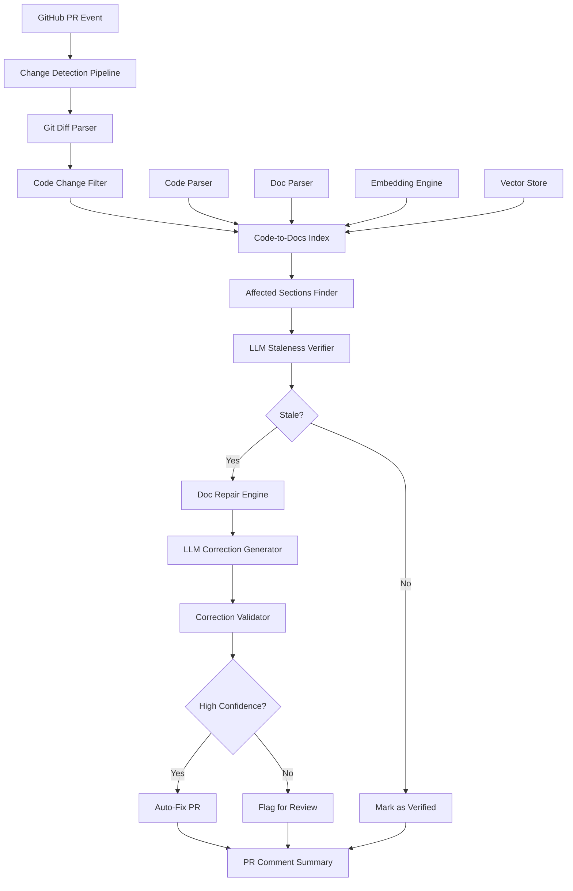

# Design Document: Self-Healing Technical Documentation

## Overview

The Self-Healing Technical Documentation system is a GitHub Action that automatically detects and corrects documentation staleness caused by code changes. When a pull request modifies code, the system identifies which documentation sections are affected, validates whether they remain accurate, and either auto-generates corrections via a new PR or flags discrepancies for human review. The system maintains a semantic link graph between code chunks and documentation sections, uses embeddings for intelligent mapping, and employs LLM-based verification to minimize false positives while ensuring high-quality automated corrections.

The system operates in five core phases: building the code-to-docs mapping, detecting meaningful changes, verifying staleness with LLM analysis, generating targeted corrections with quality validation, and integrating seamlessly into GitHub workflows via PR comments and automated fix PRs.

## Architecture



## Main Algorithm/Workflow

```mermaid
sequenceDiagram
    participant GH as GitHub PR
    participant Action as GitHub Action
    participant Parser as Code/Doc Parser
    participant Index as Code-to-Docs Index
    participant LLM as LLM Service
    participant Repair as Doc Repair Engine
    participant PR as PR Manager
    
    GH->>Action: PR created/updated
    Action->>Parser: Parse git diff
    Parser->>Index: Query affected code chunks
    Index->>Index: Find linked doc sections
    Index->>LLM: Verify staleness (code + doc)
    LLM-->>Index: Staleness verdict + diagnosis
    
    alt Documentation is stale
        Index->>Repair: Send stale sections
        Repair->>LLM: Generate corrections
        LLM-->>Repair: Corrected content
        Repair->>LLM: Validate corrections
        LLM-->>Repair: Quality assessment
        
        alt High confidence fix
            Repair->>PR: Create auto-fix PR
        else Low confidence
            Repair->>PR: Add review comment
        end
    else Documentation is accurate
        Index->>PR: Mark as verified
    end
    
    PR->>GH: Post summary comment


## Components and Interfaces

### Component 1: Code Parser

**Purpose**: Extract semantic code chunks from the codebase and assign stable identifiers

**Interface**:
```python
from dataclasses import dataclass
from typing import List, Dict, Optional

@dataclass
class CodeChunk:
    id: str  # Stable identifier: file_path + qualified_name
    type: str  # "function", "class", "api_endpoint", "config_schema", "cli_command"
    name: str
    file_path: str
    line_start: int
    line_end: int
    signature: str
    docstring: Optional[str]
    source_code: str
    metadata: Dict[str, any]

class CodeParser:
    def parse_repository(self, repo_path: str) -> List[CodeChunk]:
        """Parse entire repository and extract all code chunks."""
        pass
    
    def parse_file(self, file_path: str) -> List[CodeChunk]:
        """Parse a single file and extract code chunks."""
        pass
    
    def extract_function(self, ast_node: any) -> CodeChunk:
        """Extract function signature and metadata from AST node."""
        pass
    
    def extract_class(self, ast_node: any) -> CodeChunk:
        """Extract class definition and metadata from AST node."""
        pass


**Responsibilities**:
- Parse Python and TypeScript source files using AST
- Extract function signatures with parameter types and return types
- Extract class definitions with methods and properties
- Identify API endpoint definitions (FastAPI, Flask, Express patterns)
- Parse configuration schemas (Pydantic models, JSON schemas)
- Extract CLI command definitions (argparse, Click, Commander)
- Generate stable identifiers for each code chunk
- Preserve source location information for linking

### Component 2: Documentation Parser

**Purpose**: Split markdown documentation into semantic sections and extract code references

**Interface**:
```python
@dataclass
class DocSection:
    id: str  # Stable identifier: file_path + heading_path
    file_path: str
    heading_path: str  # e.g., "Configuration > Environment Variables"
    heading_level: int
    content: str
    code_references: List[str]  # Mentioned function/class/config names
    line_start: int
    line_end: int
    metadata: Dict[str, any]

class DocumentationParser:
    def parse_docs_directory(self, docs_path: str) -> List[DocSection]:
        """Parse all markdown files in documentation directory."""
        pass
    
    def parse_markdown_file(self, file_path: str) -> List[DocSection]:
        """Parse a single markdown file into sections."""
        pass

    
    def extract_code_references(self, content: str, known_symbols: List[str]) -> List[str]:
        """Extract references to code symbols from markdown content."""
        pass
    
    def build_heading_path(self, headings: List[str]) -> str:
        """Build hierarchical heading path from list of headings."""
        pass
```

**Responsibilities**:
- Parse markdown files using a markdown parser
- Split documents by heading structure
- Maintain heading hierarchy for context
- Extract code references from inline code, code blocks, and text
- Match mentioned symbols against known code chunks
- Generate stable identifiers for each section
- Preserve source location for updates

### Component 3: Embedding Engine

**Purpose**: Generate semantic embeddings for code and documentation to enable intelligent mapping

**Interface**:
```python
from typing import List, Tuple
import numpy as np

@dataclass
class Embedding:
    content_id: str
    vector: np.ndarray
    content_type: str  # "code" or "doc"
    metadata: Dict[str, any]

class EmbeddingEngine:
    def __init__(self, model: str = "text-embedding-3-small"):
        """Initialize with OpenAI embedding model."""
        pass

    
    def embed_code_chunk(self, chunk: CodeChunk) -> Embedding:
        """Generate embedding for a code chunk."""
        pass
    
    def embed_doc_section(self, section: DocSection) -> Embedding:
        """Generate embedding for a documentation section."""
        pass
    
    def embed_batch(self, texts: List[str]) -> List[np.ndarray]:
        """Generate embeddings for multiple texts efficiently."""
        pass
    
    def compute_similarity(self, embedding1: np.ndarray, embedding2: np.ndarray) -> float:
        """Compute cosine similarity between two embeddings."""
        pass
```

**Responsibilities**:
- Interface with OpenAI embedding API
- Batch embedding requests for efficiency
- Compute cosine similarity between embeddings
- Cache embeddings to minimize API costs
- Handle rate limiting and retries

### Component 4: Code-to-Docs Index

**Purpose**: Build and maintain the semantic link graph between code and documentation

**Interface**:
```python
@dataclass
class CodeDocLink:
    code_chunk_id: str
    doc_section_id: str
    link_type: str  # "explicit_mention", "semantic_similarity", "inferred"
    confidence: float  # 0.0 to 1.0
    metadata: Dict[str, any]


@dataclass
class CodeToDocsIndex:
    code_chunks: Dict[str, CodeChunk]
    doc_sections: Dict[str, DocSection]
    links: List[CodeDocLink]
    embeddings: Dict[str, Embedding]
    version: str
    last_updated: str

class IndexBuilder:
    def __init__(self, code_parser: CodeParser, doc_parser: DocumentationParser, 
                 embedding_engine: EmbeddingEngine):
        pass
    
    def build_index(self, repo_path: str, docs_path: str) -> CodeToDocsIndex:
        """Build complete code-to-docs index from scratch."""
        pass
    
    def link_explicit_mentions(self, code_chunks: List[CodeChunk], 
                               doc_sections: List[DocSection]) -> List[CodeDocLink]:
        """Create links based on explicit code references in docs."""
        pass
    
    def link_semantic_similarity(self, code_chunks: List[CodeChunk], 
                                 doc_sections: List[DocSection],
                                 threshold: float = 0.75) -> List[CodeDocLink]:
        """Create links based on embedding similarity above threshold."""
        pass
    
    def save_index(self, index: CodeToDocsIndex, output_path: str) -> None:
        """Persist index to JSON file."""
        pass

    
    def load_index(self, input_path: str) -> CodeToDocsIndex:
        """Load index from JSON file."""
        pass
    
    def query_affected_sections(self, code_chunk_ids: List[str]) -> List[DocSection]:
        """Find all doc sections linked to given code chunks."""
        pass
```

**Responsibilities**:
- Coordinate parsing of code and documentation
- Build explicit links via name matching heuristics
- Build semantic links via embedding similarity
- Manage link confidence scoring
- Serialize and deserialize index to/from JSON
- Query index for affected sections given code changes

### Component 5: Git Diff Parser

**Purpose**: Extract and classify meaningful code changes from git diffs

**Interface**:
```python
from enum import Enum

class ChangeType(Enum):
    SIGNATURE_CHANGE = "signature_change"
    BEHAVIOR_CHANGE = "behavior_change"
    NEW_FEATURE = "new_feature"
    REMOVED_FEATURE = "removed_feature"
    CONFIG_CHANGE = "config_change"
    COMMENT_ONLY = "comment_only"
    WHITESPACE_ONLY = "whitespace_only"
    TEST_ONLY = "test_only"

@dataclass
class CodeChange:
    file_path: str
    change_type: ChangeType
    affected_chunk_ids: List[str]
    old_content: str
    new_content: str

    diff_hunks: List[str]
    is_meaningful: bool
    metadata: Dict[str, any]

class GitDiffParser:
    def __init__(self, code_parser: CodeParser):
        pass
    
    def parse_pr_diff(self, repo_path: str, base_ref: str, head_ref: str) -> List[CodeChange]:
        """Parse git diff between two refs and extract code changes."""
        pass
    
    def classify_change(self, file_path: str, diff_hunks: List[str]) -> ChangeType:
        """Classify the type of change based on diff content."""
        pass
    
    def is_meaningful_change(self, change: CodeChange) -> bool:
        """Determine if change is likely to affect documentation."""
        pass
    
    def map_change_to_chunks(self, change: CodeChange, 
                            index: CodeToDocsIndex) -> List[str]:
        """Map file changes to affected code chunk IDs."""
        pass
```

**Responsibilities**:
- Execute git diff command and parse output
- Classify changes into semantic categories
- Filter out non-meaningful changes (whitespace, comments, tests)
- Map file-level changes to specific code chunks
- Extract old and new content for comparison

### Component 6: LLM Staleness Verifier

**Purpose**: Use LLM to verify if documentation is stale given code changes


**Interface**:
```python
@dataclass
class StalenessVerdict:
    doc_section_id: str
    is_stale: bool
    confidence: float  # 0.0 to 1.0
    diagnosis: str  # Explanation of what's wrong
    affected_parts: List[str]  # Specific lines/paragraphs that are stale
    metadata: Dict[str, any]

class LLMStalenessVerifier:
    def __init__(self, model: str = "gpt-4o", temperature: float = 0.2):
        pass
    
    def verify_section(self, doc_section: DocSection, 
                      old_code: str, new_code: str) -> StalenessVerdict:
        """Verify if doc section is still accurate given code change."""
        pass
    
    def batch_verify(self, sections: List[Tuple[DocSection, str, str]]) -> List[StalenessVerdict]:
        """Verify multiple sections in parallel for efficiency."""
        pass
    
    def build_verification_prompt(self, doc_content: str, 
                                  old_code: str, new_code: str) -> str:
        """Construct prompt for LLM verification."""
        pass
```

**Responsibilities**:
- Interface with LLM API (GPT-4o or Claude Sonnet)
- Construct effective verification prompts
- Parse LLM responses into structured verdicts
- Assign confidence scores based on response clarity
- Handle API errors and retries
- Batch requests for efficiency


### Component 7: Doc Repair Engine

**Purpose**: Generate and validate documentation corrections

**Interface**:
```python
@dataclass
class DocCorrection:
    doc_section_id: str
    original_content: str
    corrected_content: str
    changes_made: List[str]  # Description of specific changes
    confidence: float  # 0.0 to 1.0
    should_auto_fix: bool
    validation_passed: bool
    metadata: Dict[str, any]

class DocRepairEngine:
    def __init__(self, llm_model: str = "gpt-4o", temperature: float = 0.3):
        pass
    
    def generate_correction(self, verdict: StalenessVerdict, 
                           doc_section: DocSection,
                           new_code: str) -> DocCorrection:
        """Generate corrected documentation content."""
        pass
    
    def validate_correction(self, correction: DocCorrection, 
                           new_code: str) -> bool:
        """Validate that correction is accurate and high-quality."""
        pass
    
    def determine_auto_fix_eligibility(self, correction: DocCorrection) -> bool:
        """Decide if correction is safe to auto-apply."""
        pass

    
    def build_correction_prompt(self, doc_content: str, diagnosis: str, 
                               new_code: str) -> str:
        """Construct prompt for generating corrections."""
        pass
    
    def build_validation_prompt(self, original: str, corrected: str, 
                               new_code: str) -> str:
        """Construct prompt for validating corrections."""
        pass
```

**Responsibilities**:
- Generate targeted corrections that preserve style and tone
- Rewrite only stale parts, preserve accurate content
- Validate corrections for accuracy and consistency
- Determine confidence levels for auto-fix decisions
- Handle different correction modes (simple vs complex changes)
- Track what specific changes were made

### Component 8: GitHub Integration Manager

**Purpose**: Manage GitHub API interactions for creating PRs and comments

**Interface**:
```python
@dataclass
class PRSummary:
    verified_sections: List[str]
    auto_fixed_sections: List[str]
    flagged_sections: List[str]
    auto_fix_pr_number: Optional[int]
    metadata: Dict[str, any]

class GitHubIntegrationManager:
    def __init__(self, github_token: str, repo_full_name: str):
        pass

    
    def create_fix_pr(self, corrections: List[DocCorrection], 
                     base_branch: str, source_pr_number: int) -> int:
        """Create PR with auto-generated doc corrections."""
        pass
    
    def add_pr_comment(self, pr_number: int, summary: PRSummary) -> None:
        """Add summary comment to the source PR."""
        pass
    
    def add_review_flag_comment(self, pr_number: int, 
                                flagged_sections: List[StalenessVerdict]) -> None:
        """Add comment flagging sections that need human review."""
        pass
    
    def apply_corrections_to_branch(self, corrections: List[DocCorrection], 
                                   branch_name: str) -> None:
        """Apply corrections to files on a new branch."""
        pass
    
    def format_pr_description(self, corrections: List[DocCorrection], 
                             source_pr_number: int) -> str:
        """Format PR description with correction details."""
        pass
    
    def format_summary_comment(self, summary: PRSummary) -> str:
        """Format markdown summary comment."""
        pass
```

**Responsibilities**:
- Interface with GitHub API via PyGithub
- Create branches and push commits
- Create pull requests with formatted descriptions
- Add comments to PRs with formatted summaries
- Generate markdown with links to sections and PRs
- Handle API rate limiting and errors


## Data Models

### Model 1: CodeChunk

```python
@dataclass
class CodeChunk:
    id: str  # Format: "{file_path}::{qualified_name}"
    type: str  # "function" | "class" | "api_endpoint" | "config_schema" | "cli_command"
    name: str  # Simple name (e.g., "authenticate")
    qualified_name: str  # Full name (e.g., "auth.service.authenticate")
    file_path: str  # Relative to repo root
    line_start: int
    line_end: int
    signature: str  # Function signature or class header
    docstring: Optional[str]
    source_code: str  # Full source code of the chunk
    parameters: List[Dict[str, str]]  # [{"name": "user_id", "type": "int", "default": None}]
    return_type: Optional[str]
    decorators: List[str]  # e.g., ["@app.route('/api/users')", "@login_required"]
    metadata: Dict[str, any]  # Language-specific extras
```

**Validation Rules**:
- `id` must be unique across all code chunks
- `type` must be one of the defined types
- `file_path` must be a valid relative path
- `line_start` must be ≤ `line_end`
- `signature` must not be empty
- If `type` is "function", `parameters` and `return_type` should be populated

### Model 2: DocSection

```python
@dataclass
class DocSection:
    id: str  # Format: "{file_path}::{heading_path}"

    file_path: str  # Relative to docs root
    heading_path: str  # e.g., "Configuration > Environment Variables > DATABASE_URL"
    heading_level: int  # 1-6 (H1-H6)
    content: str  # Raw markdown content of the section
    code_references: List[str]  # Extracted symbol names mentioned in content
    line_start: int
    line_end: int
    parent_section_id: Optional[str]  # ID of parent section for hierarchy
    child_section_ids: List[str]  # IDs of direct child sections
    metadata: Dict[str, any]
```

**Validation Rules**:
- `id` must be unique across all doc sections
- `file_path` must be a valid markdown file path
- `heading_level` must be between 1 and 6
- `line_start` must be ≤ `line_end`
- `heading_path` must be non-empty
- Parent-child relationships must be consistent (no cycles)

### Model 3: CodeDocLink

```python
@dataclass
class CodeDocLink:
    code_chunk_id: str  # References CodeChunk.id
    doc_section_id: str  # References DocSection.id
    link_type: str  # "explicit_mention" | "semantic_similarity" | "inferred"
    confidence: float  # 0.0 to 1.0
    similarity_score: Optional[float]  # Cosine similarity if semantic link
    metadata: Dict[str, any]
```

**Validation Rules**:
- `code_chunk_id` must reference an existing CodeChunk
- `doc_section_id` must reference an existing DocSection

- `link_type` must be one of the defined types
- `confidence` must be between 0.0 and 1.0
- If `link_type` is "semantic_similarity", `similarity_score` must be present
- No duplicate links (same code_chunk_id and doc_section_id pair)

### Model 4: StalenessVerdict

```python
@dataclass
class StalenessVerdict:
    doc_section_id: str
    is_stale: bool
    confidence: float  # 0.0 to 1.0
    diagnosis: str  # Human-readable explanation
    affected_parts: List[str]  # Specific paragraphs/lines that are stale
    recommended_action: str  # "auto_fix" | "flag_for_review" | "no_action"
    code_chunk_id: str  # Which code chunk caused the staleness
    old_code: str
    new_code: str
    metadata: Dict[str, any]
```

**Validation Rules**:
- `doc_section_id` must reference an existing DocSection
- `confidence` must be between 0.0 and 1.0
- If `is_stale` is True, `diagnosis` must not be empty
- `recommended_action` must be one of the defined actions
- High confidence (≥0.8) + simple change → recommended_action should be "auto_fix"
- Low confidence (<0.8) or complex change → recommended_action should be "flag_for_review"

### Model 5: DocCorrection

```python
@dataclass
class DocCorrection:
    doc_section_id: str

    original_content: str
    corrected_content: str
    changes_made: List[str]  # Bullet points of specific changes
    confidence: float  # 0.0 to 1.0
    should_auto_fix: bool
    validation_passed: bool
    validation_report: str  # Explanation from validation LLM pass
    file_path: str  # Path to the doc file to update
    line_start: int
    line_end: int
    metadata: Dict[str, any]
```

**Validation Rules**:
- `doc_section_id` must reference an existing DocSection
- `original_content` must match the current content of the doc section
- `corrected_content` must be different from `original_content`
- `confidence` must be between 0.0 and 1.0
- If `should_auto_fix` is True, `validation_passed` must be True
- If `should_auto_fix` is True, `confidence` should be ≥0.8
- `changes_made` must not be empty

### Model 6: PRSummary

```python
@dataclass
class PRSummary:
    verified_sections: List[str]  # Doc section IDs that remain accurate
    auto_fixed_sections: List[str]  # Doc section IDs that were auto-fixed
    flagged_sections: List[str]  # Doc section IDs flagged for review
    auto_fix_pr_number: Optional[int]  # PR number if auto-fix PR was created

    source_pr_number: int  # The original PR that triggered the check
    total_sections_checked: int
    execution_time_seconds: float
    metadata: Dict[str, any]
```

**Validation Rules**:
- `source_pr_number` must be a positive integer
- `total_sections_checked` must equal sum of verified + auto_fixed + flagged sections
- `execution_time_seconds` must be positive
- If `auto_fixed_sections` is not empty, `auto_fix_pr_number` must be present

## Algorithmic Pseudocode

### Main Processing Algorithm

```python
def process_pr_for_doc_staleness(
    repo_path: str,
    docs_path: str,
    base_ref: str,
    head_ref: str,
    pr_number: int,
    config: Config
) -> PRSummary:
    """
    Main algorithm for detecting and fixing stale documentation.
    
    Preconditions:
    - repo_path is a valid git repository
    - docs_path exists and contains markdown files
    - base_ref and head_ref are valid git references
    - config contains valid LLM API credentials
    
    Postconditions:
    - Returns PRSummary with complete results
    - If auto-fixes generated, new PR is created
    - Source PR has summary comment added
    - No modifications to source PR branch
    """
    start_time = time.time()
    
    # Step 1: Load or build code-to-docs index
    index = load_or_build_index(repo_path, docs_path, config)

    
    # Step 2: Parse git diff and extract meaningful changes
    diff_parser = GitDiffParser(CodeParser())
    code_changes = diff_parser.parse_pr_diff(repo_path, base_ref, head_ref)
    meaningful_changes = [c for c in code_changes if c.is_meaningful]
    
    if len(meaningful_changes) == 0:
        return create_empty_summary(pr_number, time.time() - start_time)
    
    # Step 3: Find affected documentation sections
    affected_chunk_ids = []
    for change in meaningful_changes:
        affected_chunk_ids.extend(change.affected_chunk_ids)
    
    affected_sections = index.query_affected_sections(affected_chunk_ids)
    
    if len(affected_sections) == 0:
        return create_empty_summary(pr_number, time.time() - start_time)
    
    # Step 4: Verify staleness with LLM
    verifier = LLMStalenessVerifier(model=config.llm_model)
    verdicts = []
    
    for section in affected_sections:
        # Find the code change that affects this section
        linked_changes = find_changes_for_section(section, meaningful_changes, index)
        
        for change in linked_changes:
            verdict = verifier.verify_section(
                section, 
                change.old_content, 
                change.new_content
            )
            verdicts.append(verdict)
    
    # Step 5: Separate stale vs verified sections
    stale_verdicts = [v for v in verdicts if v.is_stale]
    verified_sections = [v.doc_section_id for v in verdicts if not v.is_stale]

    
    if len(stale_verdicts) == 0:
        summary = PRSummary(
            verified_sections=verified_sections,
            auto_fixed_sections=[],
            flagged_sections=[],
            auto_fix_pr_number=None,
            source_pr_number=pr_number,
            total_sections_checked=len(affected_sections),
            execution_time_seconds=time.time() - start_time,
            metadata={}
        )
        return summary
    
    # Step 6: Generate corrections for stale sections
    repair_engine = DocRepairEngine(llm_model=config.llm_model)
    corrections = []
    
    for verdict in stale_verdicts:
        section = index.doc_sections[verdict.doc_section_id]
        correction = repair_engine.generate_correction(verdict, section, verdict.new_code)
        
        # Validate the correction
        validation_passed = repair_engine.validate_correction(correction, verdict.new_code)
        correction.validation_passed = validation_passed
        
        # Determine if eligible for auto-fix
        correction.should_auto_fix = repair_engine.determine_auto_fix_eligibility(correction)
        
        corrections.append(correction)
    
    # Step 7: Separate auto-fix vs flag-for-review corrections
    auto_fix_corrections = [c for c in corrections if c.should_auto_fix]
    flagged_corrections = [c for c in corrections if not c.should_auto_fix]

    
    # Step 8: Create auto-fix PR if there are high-confidence corrections
    github_manager = GitHubIntegrationManager(config.github_token, config.repo_full_name)
    auto_fix_pr_number = None
    
    if len(auto_fix_corrections) > 0:
        auto_fix_pr_number = github_manager.create_fix_pr(
            auto_fix_corrections,
            base_ref,
            pr_number
        )
    
    # Step 9: Add review flag comment if there are low-confidence sections
    if len(flagged_corrections) > 0:
        flagged_verdicts = [v for v in stale_verdicts 
                           if v.doc_section_id in [c.doc_section_id for c in flagged_corrections]]
        github_manager.add_review_flag_comment(pr_number, flagged_verdicts)
    
    # Step 10: Add summary comment to source PR
    summary = PRSummary(
        verified_sections=verified_sections,
        auto_fixed_sections=[c.doc_section_id for c in auto_fix_corrections],
        flagged_sections=[c.doc_section_id for c in flagged_corrections],
        auto_fix_pr_number=auto_fix_pr_number,
        source_pr_number=pr_number,
        total_sections_checked=len(affected_sections),
        execution_time_seconds=time.time() - start_time,
        metadata={}
    )
    
    github_manager.add_pr_comment(pr_number, summary)
    
    return summary
```

**Preconditions**:
- Valid git repository at repo_path
- Documentation directory exists at docs_path

- Valid git references for base_ref and head_ref
- Config contains valid API credentials
- PR number exists and is accessible

**Postconditions**:
- Returns complete PRSummary with all results
- If auto-fixes exist, new PR is created and linked
- Summary comment is added to source PR
- Flagged sections have review comment added
- No modifications to source PR branch or commits
- Index is updated if changes detected

**Loop Invariants**:
- All processed sections maintain valid links to code chunks
- Correction confidence scores remain between 0.0 and 1.0
- Total sections = verified + auto-fixed + flagged

### Index Building Algorithm

```python
def build_code_to_docs_index(
    repo_path: str,
    docs_path: str,
    similarity_threshold: float = 0.75
) -> CodeToDocsIndex:
    """
    Build the complete code-to-docs index with explicit and semantic links.
    
    Preconditions:
    - repo_path contains valid source code files
    - docs_path contains valid markdown files
    - similarity_threshold is between 0.0 and 1.0
    
    Postconditions:
    - Returns complete index with all code chunks and doc sections
    - All explicit mentions are linked
    - Semantic similarities above threshold are linked
    - Index is serializable to JSON
    """
    code_parser = CodeParser()
    doc_parser = DocumentationParser()
    embedding_engine = EmbeddingEngine()

    
    # Step 1: Parse all code chunks from repository
    code_chunks = code_parser.parse_repository(repo_path)
    code_chunks_dict = {chunk.id: chunk for chunk in code_chunks}
    
    # Step 2: Parse all documentation sections
    doc_sections = doc_parser.parse_docs_directory(docs_path)
    doc_sections_dict = {section.id: section for section in doc_sections}
    
    # Step 3: Build symbol name lookup for explicit linking
    symbol_names = {chunk.name: chunk.id for chunk in code_chunks}
    symbol_names.update({chunk.qualified_name: chunk.id for chunk in code_chunks})
    
    # Step 4: Create explicit mention links
    explicit_links = []
    for section in doc_sections:
        for code_ref in section.code_references:
            if code_ref in symbol_names:
                link = CodeDocLink(
                    code_chunk_id=symbol_names[code_ref],
                    doc_section_id=section.id,
                    link_type="explicit_mention",
                    confidence=0.95,
                    similarity_score=None,
                    metadata={"matched_symbol": code_ref}
                )
                explicit_links.append(link)
    
    # Step 5: Generate embeddings for code and docs
    embeddings_dict = {}
    
    # Batch embed code chunks
    code_texts = [f"{chunk.signature}\n{chunk.docstring or ''}" for chunk in code_chunks]
    code_embeddings = embedding_engine.embed_batch(code_texts)
    
    for chunk, embedding in zip(code_chunks, code_embeddings):

        embeddings_dict[chunk.id] = Embedding(
            content_id=chunk.id,
            vector=embedding,
            content_type="code",
            metadata={"chunk_type": chunk.type}
        )
    
    # Batch embed doc sections
    doc_texts = [f"{section.heading_path}\n{section.content}" for section in doc_sections]
    doc_embeddings = embedding_engine.embed_batch(doc_texts)
    
    for section, embedding in zip(doc_sections, doc_embeddings):
        embeddings_dict[section.id] = Embedding(
            content_id=section.id,
            vector=embedding,
            content_type="doc",
            metadata={}
        )
    
    # Step 6: Create semantic similarity links
    semantic_links = []
    
    for section in doc_sections:
        section_embedding = embeddings_dict[section.id].vector
        
        # Skip sections that already have explicit links
        already_linked_chunks = {link.code_chunk_id for link in explicit_links 
                                if link.doc_section_id == section.id}
        
        for chunk in code_chunks:
            if chunk.id in already_linked_chunks:
                continue
            
            chunk_embedding = embeddings_dict[chunk.id].vector
            similarity = embedding_engine.compute_similarity(
                section_embedding, 
                chunk_embedding
            )
            
            if similarity >= similarity_threshold:
                link = CodeDocLink(
                    code_chunk_id=chunk.id,

                    doc_section_id=section.id,
                    link_type="semantic_similarity",
                    confidence=similarity,
                    similarity_score=similarity,
                    metadata={}
                )
                semantic_links.append(link)
    
    # Step 7: Combine all links and build index
    all_links = explicit_links + semantic_links
    
    index = CodeToDocsIndex(
        code_chunks=code_chunks_dict,
        doc_sections=doc_sections_dict,
        links=all_links,
        embeddings=embeddings_dict,
        version="1.0",
        last_updated=datetime.now().isoformat()
    )
    
    return index
```

**Preconditions**:
- repo_path is a directory containing parseable source files
- docs_path is a directory containing markdown files
- similarity_threshold ∈ [0.0, 1.0]
- Embedding API is accessible and authenticated

**Postconditions**:
- Returns CodeToDocsIndex with all components populated
- All code chunks have stable IDs
- All doc sections have stable IDs
- Explicit links created for all detected code references
- Semantic links created for similarities ≥ threshold
- No duplicate links exist
- Index can be serialized to JSON

**Loop Invariants**:
- For code chunk parsing: All processed chunks have unique IDs
- For doc section parsing: All processed sections have unique IDs
- For explicit linking: No duplicate links created
- For semantic linking: Similarity scores ≥ threshold


### Staleness Verification Algorithm

```python
def verify_section_staleness(
    doc_section: DocSection,
    old_code: str,
    new_code: str,
    llm_client: LLMClient
) -> StalenessVerdict:
    """
    Verify if a documentation section is stale given code changes.
    
    Preconditions:
    - doc_section is a valid DocSection with non-empty content
    - old_code and new_code are non-empty strings
    - llm_client is authenticated and available
    
    Postconditions:
    - Returns StalenessVerdict with is_stale determination
    - If stale, diagnosis explains what's wrong
    - Confidence score is between 0.0 and 1.0
    - Recommended action is appropriate for confidence level
    """
    # Build verification prompt
    prompt = f"""You are a technical documentation validator. Your task is to determine if the following documentation section is still accurate after a code change.

Documentation Section:
File: {doc_section.file_path}
Heading: {doc_section.heading_path}
Content:
{doc_section.content}

OLD CODE:
{old_code}

NEW CODE:
{new_code}

Analyze the documentation against the new code and answer:
1. Is the documentation still accurate? (Yes/No)
2. Confidence level (0.0 to 1.0)
3. If inaccurate, what specifically is wrong?
4. Which parts of the documentation need updating?

Respond in JSON format:
{{
  "is_stale": boolean,

  "confidence": float,
  "diagnosis": string,
  "affected_parts": [list of specific paragraphs/sentences that are wrong]
}}"""
    
    # Call LLM
    response = llm_client.chat_completion(
        messages=[{"role": "user", "content": prompt}],
        temperature=0.2,
        response_format={"type": "json_object"}
    )
    
    # Parse response
    result = json.loads(response.choices[0].message.content)
    
    # Determine recommended action based on confidence and complexity
    if not result["is_stale"]:
        recommended_action = "no_action"
    elif result["confidence"] >= 0.8 and is_simple_change(old_code, new_code):
        recommended_action = "auto_fix"
    else:
        recommended_action = "flag_for_review"
    
    # Build verdict
    verdict = StalenessVerdict(
        doc_section_id=doc_section.id,
        is_stale=result["is_stale"],
        confidence=result["confidence"],
        diagnosis=result["diagnosis"],
        affected_parts=result["affected_parts"],
        recommended_action=recommended_action,
        code_chunk_id="",  # Filled by caller
        old_code=old_code,
        new_code=new_code,
        metadata={}
    )
    
    return verdict
```

**Preconditions**:
- doc_section.content is non-empty
- old_code ≠ new_code
- LLM client has valid API credentials

- LLM API is available and responsive

**Postconditions**:
- Returns valid StalenessVerdict
- verdict.confidence ∈ [0.0, 1.0]
- If verdict.is_stale = True, then verdict.diagnosis ≠ ""
- recommended_action is consistent with confidence and change complexity
- High confidence (≥0.8) + simple change → "auto_fix"
- Low confidence (<0.8) or complex change → "flag_for_review"

### Correction Generation Algorithm

```python
def generate_documentation_correction(
    verdict: StalenessVerdict,
    doc_section: DocSection,
    new_code: str,
    llm_client: LLMClient
) -> DocCorrection:
    """
    Generate corrected documentation content for a stale section.
    
    Preconditions:
    - verdict.is_stale is True
    - doc_section matches verdict.doc_section_id
    - new_code is non-empty
    - llm_client is authenticated and available
    
    Postconditions:
    - Returns DocCorrection with corrected content
    - corrected_content ≠ original_content
    - Preserves sections that are still accurate
    - Maintains original style and tone
    - Includes list of specific changes made
    """
    # Build correction prompt
    prompt = f"""You are a technical documentation editor. Your task is to correct a stale documentation section to match the new code.

IMPORTANT INSTRUCTIONS:
1. Only rewrite the parts that are inaccurate
2. Preserve all content that is still correct
3. Maintain the original writing style and tone
4. Keep the same markdown structure
5. Be specific and precise

Documentation Section:
{doc_section.content}

NEW CODE:
{new_code}

STALENESS DIAGNOSIS:
{verdict.diagnosis}

AFFECTED PARTS:
{', '.join(verdict.affected_parts)}

Generate the corrected documentation and list the specific changes you made.

Respond in JSON format:
{{

  "corrected_content": string,
  "changes_made": [list of bullet points describing specific changes],
  "confidence": float
}}"""
    
    # Call LLM
    response = llm_client.chat_completion(
        messages=[{"role": "user", "content": prompt}],
        temperature=0.3,
        response_format={"type": "json_object"}
    )
    
    # Parse response
    result = json.loads(response.choices[0].message.content)
    
    # Create initial correction
    correction = DocCorrection(
        doc_section_id=doc_section.id,
        original_content=doc_section.content,
        corrected_content=result["corrected_content"],
        changes_made=result["changes_made"],
        confidence=result["confidence"],
        should_auto_fix=False,  # Will be determined after validation
        validation_passed=False,  # Will be set by validation
        validation_report="",
        file_path=doc_section.file_path,
        line_start=doc_section.line_start,
        line_end=doc_section.line_end,
        metadata={}
    )
    
    # Validate the correction
    validation_passed = validate_correction(correction, new_code, llm_client)
    correction.validation_passed = validation_passed
    
    # Determine auto-fix eligibility
    if validation_passed and correction.confidence >= 0.8 and is_simple_correction(correction):
        correction.should_auto_fix = True
    else:
        correction.should_auto_fix = False
    
    return correction
```


**Preconditions**:
- verdict.is_stale = True
- doc_section.id = verdict.doc_section_id
- new_code is valid source code
- LLM API is available

**Postconditions**:
- Returns valid DocCorrection
- correction.corrected_content ≠ correction.original_content
- correction.changes_made is non-empty
- correction.confidence ∈ [0.0, 1.0]
- If validation_passed and confidence ≥ 0.8 and simple change, then should_auto_fix = True
- Otherwise should_auto_fix = False

### Correction Validation Algorithm

```python
def validate_correction(
    correction: DocCorrection,
    new_code: str,
    llm_client: LLMClient
) -> bool:
    """
    Validate that a correction is accurate and high-quality.
    
    Preconditions:
    - correction has valid original_content and corrected_content
    - new_code is non-empty
    - llm_client is authenticated and available
    
    Postconditions:
    - Returns True if correction passes all validation checks
    - Returns False if any validation check fails
    - Updates correction.validation_report with explanation
    """
    # Build validation prompt
    prompt = f"""You are a technical documentation quality reviewer. Your task is to validate that a documentation correction is accurate and well-written.

ORIGINAL DOCUMENTATION:
{correction.original_content}

CORRECTED DOCUMENTATION:
{correction.corrected_content}

NEW CODE:
{new_code}

CHANGES CLAIMED:
{chr(10).join('- ' + change for change in correction.changes_made)}

Validate the correction against these criteria:
1. Does the corrected documentation accurately describe the new code?
2. Were the parts that were already correct preserved?

3. Is the writing style consistent with the original?
4. Are there any factual errors or misleading statements?
5. Is the correction complete (all affected parts updated)?

Respond in JSON format:
{{
  "validation_passed": boolean,
  "accuracy_score": float (0.0 to 1.0),
  "style_consistency_score": float (0.0 to 1.0),
  "completeness_score": float (0.0 to 1.0),
  "report": string (explanation of validation result),
  "issues_found": [list of any issues]
}}"""
    
    # Call LLM
    response = llm_client.chat_completion(
        messages=[{"role": "user", "content": prompt}],
        temperature=0.2,
        response_format={"type": "json_object"}
    )
    
    # Parse response
    result = json.loads(response.choices[0].message.content)
    
    # Store validation report
    correction.validation_report = result["report"]
    correction.metadata["validation_scores"] = {
        "accuracy": result["accuracy_score"],
        "style_consistency": result["style_consistency_score"],
        "completeness": result["completeness_score"]
    }
    correction.metadata["validation_issues"] = result["issues_found"]
    
    # Validation passes if:
    # 1. LLM says it passed
    # 2. All scores are >= 0.7
    # 3. No critical issues found
    passed = (
        result["validation_passed"] and
        result["accuracy_score"] >= 0.7 and
        result["style_consistency_score"] >= 0.7 and
        result["completeness_score"] >= 0.7
    )
    
    return passed
```

**Preconditions**:
- correction.original_content ≠ correction.corrected_content

- new_code is valid source code
- LLM API is available

**Postconditions**:
- Returns boolean validation result
- correction.validation_report is updated with explanation
- correction.metadata contains validation scores
- True if and only if all validation criteria met:
  - LLM validation_passed = True
  - accuracy_score ≥ 0.7
  - style_consistency_score ≥ 0.7
  - completeness_score ≥ 0.7

## Key Functions with Formal Specifications

### Function 1: parse_repository()

```python
def parse_repository(self, repo_path: str) -> List[CodeChunk]:
    """Parse entire repository and extract all code chunks."""
    pass
```

**Preconditions:**
- `repo_path` is a valid directory path
- `repo_path` contains at least one parseable source file
- Parser has read permissions for the directory

**Postconditions:**
- Returns list of CodeChunk objects
- Each CodeChunk has a unique ID
- Each CodeChunk.file_path is relative to repo_path
- All parseable functions, classes, and definitions are extracted
- Empty list returned if no code chunks found

**Loop Invariants:**
- All processed chunks have unique IDs
- All chunk IDs follow format "{file_path}::{qualified_name}"

### Function 2: query_affected_sections()

```python
def query_affected_sections(self, code_chunk_ids: List[str]) -> List[DocSection]:
    """Find all doc sections linked to given code chunks."""
    pass
```

**Preconditions:**
- `code_chunk_ids` is a non-empty list
- All IDs in `code_chunk_ids` exist in the index
- Index is properly initialized with links


**Postconditions:**
- Returns list of unique DocSection objects
- Each returned section has at least one link to a chunk in `code_chunk_ids`
- No duplicate sections in result
- Empty list returned if no sections are linked

**Loop Invariants:**
- All returned sections are unique (no duplicates)
- All returned sections have valid links to input code chunks

### Function 3: compute_similarity()

```python
def compute_similarity(self, embedding1: np.ndarray, embedding2: np.ndarray) -> float:
    """Compute cosine similarity between two embeddings."""
    pass
```

**Preconditions:**
- `embedding1` and `embedding2` are non-null numpy arrays
- Both embeddings have the same dimensionality
- Both embeddings are normalized (or will be normalized internally)
- Both arrays contain finite values (no NaN or Inf)

**Postconditions:**
- Returns float in range [-1.0, 1.0]
- For identical embeddings, returns 1.0
- For orthogonal embeddings, returns 0.0
- For opposite embeddings, returns -1.0
- Result is symmetric: similarity(A, B) = similarity(B, A)

### Function 4: create_fix_pr()

```python
def create_fix_pr(self, corrections: List[DocCorrection], 
                 base_branch: str, source_pr_number: int) -> int:
    """Create PR with auto-generated doc corrections."""
    pass
```

**Preconditions:**
- `corrections` is non-empty list of valid DocCorrection objects
- All corrections have `validation_passed = True`
- All corrections have `should_auto_fix = True`
- `base_branch` exists in the repository

- `source_pr_number` is a valid PR number
- GitHub API credentials are valid
- Repository has write access

**Postconditions:**
- Returns PR number (positive integer) of created PR
- New branch is created from `base_branch`
- All corrections are applied to their respective files
- Commit is created with descriptive message
- PR is created with title and description
- PR references `source_pr_number` in description
- Branch is pushed to remote

**Loop Invariants:**
- All applied corrections maintain file structure integrity
- All file modifications are properly committed

### Function 5: is_meaningful_change()

```python
def is_meaningful_change(self, change: CodeChange) -> bool:
    """Determine if change is likely to affect documentation."""
    pass
```

**Preconditions:**
- `change` is a valid CodeChange object
- `change.change_type` is a valid ChangeType enum value
- `change.diff_hunks` is non-empty

**Postconditions:**
- Returns True if change should trigger documentation check
- Returns False if change is safe to ignore
- Decision based on change_type:
  - SIGNATURE_CHANGE → True
  - BEHAVIOR_CHANGE → True
  - NEW_FEATURE → True
  - REMOVED_FEATURE → True
  - CONFIG_CHANGE → True
  - COMMENT_ONLY → False
  - WHITESPACE_ONLY → False
  - TEST_ONLY → False

## Example Usage

```python
# Example 1: Build the code-to-docs index
from self_healing_docs import CodeParser, DocumentationParser, EmbeddingEngine, IndexBuilder

code_parser = CodeParser()
doc_parser = DocumentationParser()
embedding_engine = EmbeddingEngine(model="text-embedding-3-small")

builder = IndexBuilder(code_parser, doc_parser, embedding_engine)
index = builder.build_index(
    repo_path="/path/to/repo",

    docs_path="/path/to/docs"
)
builder.save_index(index, ".self-healing-docs/index.json")

# Example 2: Process a PR for documentation staleness
from self_healing_docs import process_pr_for_doc_staleness, Config

config = Config(
    llm_model="gpt-4o",
    github_token=os.environ["GITHUB_TOKEN"],
    repo_full_name="owner/repo",
    similarity_threshold=0.75,
    auto_fix_confidence_threshold=0.8
)

summary = process_pr_for_doc_staleness(
    repo_path="/path/to/repo",
    docs_path="/path/to/docs",
    base_ref="main",
    head_ref="feature-branch",
    pr_number=42,
    config=config
)

print(f"Checked {summary.total_sections_checked} sections")
print(f"Verified accurate: {len(summary.verified_sections)}")
print(f"Auto-fixed: {len(summary.auto_fixed_sections)}")
print(f"Flagged for review: {len(summary.flagged_sections)}")
if summary.auto_fix_pr_number:
    print(f"Auto-fix PR created: #{summary.auto_fix_pr_number}")

# Example 3: Verify a single section for staleness
from self_healing_docs import LLMStalenessVerifier, DocSection

verifier = LLMStalenessVerifier(model="gpt-4o", temperature=0.2)

doc_section = DocSection(
    id="docs/api.md::Authentication",
    file_path="docs/api.md",
    heading_path="API Reference > Authentication",
    heading_level=2,
    content="To authenticate, pass the API key in the X-API-Key header.",
    code_references=["authenticate"],
    line_start=10,
    line_end=15,
    parent_section_id=None,
    child_section_ids=[],
    metadata={}
)

old_code = """
def authenticate(api_key: str) -> bool:
    return api_key in valid_keys
"""

new_code = """
def authenticate(request: Request) -> bool:
    token = request.headers.get("Authorization")

    return token and verify_jwt(token)
"""

verdict = verifier.verify_section(doc_section, old_code, new_code)

if verdict.is_stale:
    print(f"STALE (confidence: {verdict.confidence})")
    print(f"Diagnosis: {verdict.diagnosis}")
    print(f"Action: {verdict.recommended_action}")
else:
    print("Documentation is still accurate")

# Example 4: Generate and validate a correction
from self_healing_docs import DocRepairEngine

repair_engine = DocRepairEngine(llm_model="gpt-4o", temperature=0.3)

if verdict.is_stale:
    correction = repair_engine.generate_correction(
        verdict=verdict,
        doc_section=doc_section,
        new_code=new_code
    )
    
    print(f"Correction confidence: {correction.confidence}")
    print(f"Validation passed: {correction.validation_passed}")
    print(f"Should auto-fix: {correction.should_auto_fix}")
    print("\nChanges made:")
    for change in correction.changes_made:
        print(f"  - {change}")
    print(f"\nCorrected content:\n{correction.corrected_content}")

# Example 5: Create a fix PR
from self_healing_docs import GitHubIntegrationManager

github_manager = GitHubIntegrationManager(
    github_token=os.environ["GITHUB_TOKEN"],
    repo_full_name="owner/repo"
)

auto_fix_corrections = [correction]  # List of corrections with should_auto_fix=True

fix_pr_number = github_manager.create_fix_pr(
    corrections=auto_fix_corrections,
    base_branch="main",
    source_pr_number=42
)

print(f"Created fix PR: #{fix_pr_number}")

# Example 6: Query affected sections after code change
changed_chunk_ids = ["src/auth.py::authenticate", "src/auth.py::verify_jwt"]
affected_sections = index.query_affected_sections(changed_chunk_ids)

print(f"Found {len(affected_sections)} affected documentation sections:")
for section in affected_sections:
    print(f"  - {section.heading_path} ({section.file_path})")
```

## Correctness Properties

*A property is a characteristic or behavior that should hold true across all valid executions of a system—essentially, a formal statement about what the system should do. Properties serve as the bridge between human-readable specifications and machine-verifiable correctness guarantees.*

### Property 1: Index Completeness
**Universal Quantification:**
```
∀ code_chunk ∈ repository:
  parseable(code_chunk) ⟹ ∃ chunk_id ∈ index.code_chunks: 
    chunk_id corresponds to code_chunk
```

**Meaning**: Every parseable code chunk in the repository must be represented in the index.

**Test Approach**: Property-based test that generates random code files, builds index, and verifies all parseable elements are captured.

**Validates: Requirements 1.1, 1.2, 1.3, 1.4, 1.5, 4.1**

### Property 2: Link Consistency
**Universal Quantification:**
```
∀ link ∈ index.links:
  (link.code_chunk_id ∈ index.code_chunks) ∧ 
  (link.doc_section_id ∈ index.doc_sections) ∧
  (0.0 ≤ link.confidence ≤ 1.0)
```

**Meaning**: Every link in the index must reference valid code chunks and doc sections, with valid confidence scores.

**Test Approach**: Property-based test that generates random indexes and verifies all links maintain referential integrity.

**Validates: Requirements 4.2, 4.3, 4.4, 4.5, 4.6, 11.5**

### Property 3: Staleness Detection Soundness
**Universal Quantification:**
```
∀ section ∈ affected_sections:
  ∀ verdict ∈ verify(section, old_code, new_code):
    verdict.is_stale = true ⟹ 
      ∃ discrepancy between section.content and new_code
```

**Meaning**: If the verifier marks a section as stale, there must be an actual discrepancy between the documentation and the new code.

**Test Approach**: Create test cases with known stale/accurate documentation pairs and verify the LLM correctly identifies staleness.

**Validates: Requirements 6.3, 6.4, 6.5, 6.6, 6.7**

### Property 4: Correction Preservation
**Universal Quantification:**
```
∀ correction ∈ generated_corrections:
  correction.validation_passed = true ⟹
    (preserves_accurate_content(correction) ∧ 
     fixes_stale_content(correction) ∧
     maintains_style(correction))
```

**Meaning**: Valid corrections must preserve accurate content, fix stale content, and maintain original style.

**Test Approach**: Property-based test that generates corrections and validates they meet all three criteria.

**Validates: Requirements 7.3, 7.4, 7.5, 7.8, 7.9**


### Property 5: No False Positives in Auto-Fix
**Universal Quantification:**
```
∀ correction ∈ corrections:
  correction.should_auto_fix = true ⟹
    (correction.validation_passed = true ∧
     correction.confidence ≥ 0.8 ∧
     is_simple_change(correction))
```

**Meaning**: Auto-fix should only be enabled for corrections that pass validation, have high confidence, and involve simple changes.

**Test Approach**: Unit tests that verify auto-fix logic correctly gates on all three conditions.

**Validates: Requirements 7.10, 8.1**

### Property 6: Summary Completeness
**Universal Quantification:**
```
∀ summary ∈ PR_summaries:
  summary.total_sections_checked = 
    |summary.verified_sections| + 
    |summary.auto_fixed_sections| + 
    |summary.flagged_sections|
```

**Meaning**: The total sections checked must equal the sum of verified, auto-fixed, and flagged sections.

**Test Approach**: Property-based test that generates random processing results and verifies the accounting is correct.

**Validates: Requirements 10.2, 10.3, 10.4, 10.5**

### Property 7: Idempotency of Index Building
**Universal Quantification:**
```
∀ repo_state:
  index1 = build_index(repo_state) ∧
  index2 = build_index(repo_state) ⟹
    index1 ≅ index2 (structurally equivalent)
```

**Meaning**: Building the index twice on the same repository state should produce equivalent results.

**Test Approach**: Build index twice on same codebase, verify all chunks, sections, and links match.

**Validates: Requirements 4.9, 4.10, 11.1, 11.6**

### Property 8: Monotonicity of Similarity Threshold
**Universal Quantification:**
```
∀ threshold1, threshold2:
  threshold1 < threshold2 ⟹
    |links_at_threshold(threshold2)| ≤ |links_at_threshold(threshold1)|
```

**Meaning**: Higher similarity thresholds should produce fewer or equal semantic links.

**Test Approach**: Property-based test that generates random embeddings and verifies link count decreases with higher thresholds.

**Validates: Requirements 4.3, 16.1**

### Property 9: Index Serialization Round-Trip
**Universal Quantification:**
```
∀ index ∈ valid_indexes:
  deserialize(serialize(index)) ≅ index
```

**Meaning**: For any valid index, serializing then deserializing should produce an equivalent index structure.

**Test Approach**: Property-based test that generates random indexes, serializes and deserializes them, and verifies structural equivalence.

**Validates: Requirements 11.1, 11.4, 11.5, 20.1, 20.2, 20.3, 20.4, 20.5**

### Property 10: Stable Identifier Uniqueness
**Universal Quantification:**
```
∀ elements ∈ {code_chunks ∪ doc_sections}:
  ∀ e1, e2 ∈ elements: e1 ≠ e2 ⟹ e1.id ≠ e2.id
```

**Meaning**: All code chunks and doc sections must have unique identifiers.

**Test Approach**: Property-based test that generates repositories and docs, verifies no duplicate IDs exist.

**Validates: Requirements 1.6, 2.2, 4.9, 4.10**

### Property 11: Embedding Dimensionality Consistency
**Universal Quantification:**
```
∀ embedding1, embedding2 ∈ generated_embeddings:
  len(embedding1.vector) = len(embedding2.vector)
```

**Meaning**: All embeddings generated by the system must have the same vector dimensionality.

**Test Approach**: Property-based test that generates embeddings for various inputs and verifies consistent dimensions.

**Validates: Requirements 3.4**

### Property 12: Cosine Similarity Range
**Universal Quantification:**
```
∀ embedding1, embedding2 ∈ embeddings:
  -1.0 ≤ compute_similarity(embedding1, embedding2) ≤ 1.0
```

**Meaning**: Cosine similarity scores must always be in the valid mathematical range.

**Test Approach**: Property-based test that computes similarity for random embedding pairs and verifies range.

**Validates: Requirements 3.5**

### Property 13: Meaningful Change Filtering
**Universal Quantification:**
```
∀ change ∈ code_changes:
  (is_comment_only(change) ∨ is_whitespace_only(change) ∨ is_test_only(change)) ⟹
    is_meaningful(change) = false
```

**Meaning**: Changes that only affect comments, whitespace, or tests should never be marked as meaningful.

**Test Approach**: Property-based test that generates various change types and verifies correct filtering.

**Validates: Requirements 5.3, 5.4**

### Property 14: Confidence Score Range
**Universal Quantification:**
```
∀ entity ∈ {verdicts ∪ corrections ∪ links}:
  0.0 ≤ entity.confidence ≤ 1.0
```

**Meaning**: All confidence scores throughout the system must be in the valid range [0.0, 1.0].

**Test Approach**: Property-based test that generates verdicts, corrections, and links, verifying confidence bounds.

**Validates: Requirements 4.4, 6.5, 7.2**

### Property 15: Auto-Fix Eligibility Preconditions
**Universal Quantification:**
```
∀ correction ∈ corrections:
  correction.should_auto_fix = true ⟹
    (correction.validation_passed = true ∧
     correction.confidence ≥ auto_fix_threshold ∧
     is_simple_change(correction))
```

**Meaning**: A correction can only be marked for auto-fix if it passes validation, has high confidence, and involves a simple change.

**Test Approach**: Property-based test verifying the logical preconditions for auto-fix eligibility.

**Validates: Requirements 7.9, 7.10, 16.2**


## Error Handling

### Error Scenario 1: LLM API Rate Limiting

**Condition**: Embedding or LLM API returns 429 (rate limit exceeded)

**Response**:
- Catch rate limit exception
- Implement exponential backoff retry strategy
- Wait time: 2^attempt seconds (max 5 attempts)
- Log warning with retry attempt number
- If all retries exhausted, fail gracefully with partial results

**Recovery**:
- Continue processing other sections that don't require API calls
- Include error in summary metadata
- Post comment to PR explaining partial results due to rate limits

### Error Scenario 2: Git Diff Parsing Failure

**Condition**: Git diff command fails or produces unparseable output

**Response**:
- Catch git command exception
- Log error with git command and exit code
- Check if base_ref and head_ref exist
- Verify repository is in clean state
- Return empty change set

**Recovery**:
- Post comment to PR: "Unable to parse git diff - please check repository state"
- Exit gracefully without processing
- Store error details in action logs

### Error Scenario 3: Invalid Index File

**Condition**: Attempting to load index.json that is corrupted or has schema mismatch

**Response**:
- Catch JSON parsing exception or validation error
- Log warning about corrupted index
- Attempt to rebuild index from scratch
- If rebuild fails, exit with error

**Recovery**:
- Delete corrupted index file
- Rebuild fresh index from current codebase
- Continue with normal processing
- Log index rebuild event for monitoring


### Error Scenario 4: GitHub API Permission Denied

**Condition**: GitHub API returns 403 (forbidden) when creating PR or adding comments

**Response**:
- Catch permission exception
- Verify GitHub token has required scopes (repo, pull_request)
- Log error with required vs actual permissions
- Skip PR/comment creation

**Recovery**:
- Save corrections to local file: `.self-healing-docs/corrections.json`
- Log instructions for manual PR creation
- Exit with partial success status
- Post to action logs: "Insufficient GitHub permissions - corrections saved locally"

### Error Scenario 5: Code Parser AST Error

**Condition**: AST parser encounters syntax error or unsupported language construct

**Response**:
- Catch AST parsing exception
- Log warning with file path and line number
- Skip the problematic file/function
- Continue parsing other files
- Track skipped files in metadata

**Recovery**:
- Include skipped files in summary comment
- Suggest manual review for unparseable code
- Continue with index building for parseable files
- Store error count and file list in index metadata

### Error Scenario 6: Embedding Dimension Mismatch

**Condition**: Loaded embeddings have different dimensions than current model

**Response**:
- Detect dimension mismatch during similarity computation
- Log error with expected vs actual dimensions
- Invalidate all stored embeddings
- Trigger full re-embedding

**Recovery**:
- Clear all embeddings from index
- Re-embed all code chunks and doc sections with new model
- Rebuild semantic similarity links
- Save updated index with new model version


### Error Scenario 7: LLM Returns Invalid JSON

**Condition**: LLM response cannot be parsed as valid JSON

**Response**:
- Catch JSON parsing exception
- Log the raw LLM response for debugging
- Retry the request once with more explicit JSON format instructions
- If retry fails, mark verdict/correction as low confidence

**Recovery**:
- Set confidence to 0.5 (medium-low)
- Set recommended_action to "flag_for_review"
- Include error note in diagnosis: "LLM response format error - manual review recommended"
- Continue processing other sections

### Error Scenario 8: Empty or Missing Documentation

**Condition**: docs_path exists but contains no markdown files

**Response**:
- Detect empty documentation directory during parsing
- Log warning about missing documentation
- Return empty doc_sections list
- Skip documentation processing

**Recovery**:
- Post comment to PR: "No documentation found - skipping documentation checks"
- Exit gracefully with success status
- Log event for monitoring (may indicate misconfigured docs path)

## Testing Strategy

### Unit Testing Approach

**Test Coverage Goals**: 80% code coverage minimum

**Key Test Cases**:
1. **Code Parser Tests**:
   - Parse Python files with functions, classes, decorators
   - Parse TypeScript files with interfaces, types, arrow functions
   - Handle syntax errors gracefully
   - Extract correct line numbers and signatures

2. **Doc Parser Tests**:
   - Parse markdown with various heading levels
   - Extract code references from inline code and code blocks
   - Build correct heading hierarchies
   - Handle malformed markdown

3. **Embedding Tests**:
   - Compute similarity between known similar/dissimilar texts
   - Batch embedding efficiency
   - Handle API errors and retries
   - Cache hit/miss behavior

4. **Index Builder Tests**:

   - Build index from sample repository
   - Verify explicit links created correctly
   - Verify semantic links above threshold
   - Serialize and deserialize index without data loss
   - Query affected sections returns correct results

5. **Git Diff Parser Tests**:
   - Classify different change types correctly
   - Filter non-meaningful changes
   - Map changes to code chunks
   - Handle binary file changes

6. **Correction Generation Tests**:
   - Generate corrections that fix stale content
   - Preserve accurate content in corrections
   - Maintain style consistency
   - Validation catches poor corrections

**Testing Framework**: pytest with fixtures for sample repos and docs

### Property-Based Testing Approach

**Property Test Library**: Hypothesis (Python)

**Key Properties to Test**:

1. **Property: Index Building Idempotency**
   ```python
   @given(st.repo_structure())
   def test_index_building_idempotent(repo):
       index1 = build_index(repo)
       index2 = build_index(repo)
       assert index1.code_chunks == index2.code_chunks
       assert index1.doc_sections == index2.doc_sections
       assert len(index1.links) == len(index2.links)
   ```

2. **Property: Link Referential Integrity**
   ```python
   @given(st.code_to_docs_index())
   def test_link_integrity(index):
       for link in index.links:
           assert link.code_chunk_id in index.code_chunks
           assert link.doc_section_id in index.doc_sections
           assert 0.0 <= link.confidence <= 1.0
   ```

3. **Property: Similarity Score Bounds**
   ```python
   @given(st.embeddings(), st.embeddings())
   def test_similarity_bounds(emb1, emb2):
       similarity = compute_similarity(emb1, emb2)
       assert -1.0 <= similarity <= 1.0
   ```

4. **Property: Summary Accounting**

   ```python
   @given(st.pr_summary())
   def test_summary_completeness(summary):
       total = (len(summary.verified_sections) + 
                len(summary.auto_fixed_sections) + 
                len(summary.flagged_sections))
       assert total == summary.total_sections_checked
   ```

5. **Property: Auto-Fix Gate Conditions**
   ```python
   @given(st.doc_correction())
   def test_auto_fix_conditions(correction):
       if correction.should_auto_fix:
           assert correction.validation_passed
           assert correction.confidence >= 0.8
   ```

6. **Property: Correction Content Differs**
   ```python
   @given(st.doc_correction())
   def test_correction_differs(correction):
       if correction.validation_passed:
           assert correction.corrected_content != correction.original_content
   ```

### Integration Testing Approach

**Test Environment**: Docker container with sample repository

**Key Integration Tests**:

1. **End-to-End PR Processing**:
   - Set up sample repository with code and docs
   - Create PR with code changes
   - Run full pipeline
   - Verify correct sections identified
   - Verify PR comments created
   - Verify auto-fix PR created if applicable

2. **GitHub API Integration**:
   - Test PR creation with real GitHub API (test repo)
   - Test comment posting
   - Test branch creation and pushing
   - Test permission error handling

3. **LLM API Integration**:
   - Test OpenAI API calls with real API
   - Test rate limiting behavior
   - Test retry logic
   - Test response parsing

4. **Real Repository Testing**:
   - Fork FastAPI or similar well-documented project
   - Make deliberate code changes that invalidate docs
   - Run the action
   - Measure accuracy (true positives, false positives, false negatives)
   - Validate correction quality manually

**Success Criteria**:
- True positive rate ≥ 85% (correctly identifies stale docs)
- False positive rate ≤ 10% (rarely flags accurate docs)
- False negative rate ≤ 15% (rarely misses stale docs)

- Correction acceptance rate ≥ 70% (percentage of corrections that maintainers accept)

## Performance Considerations

### Optimization 1: Incremental Index Updates

**Problem**: Rebuilding the entire index on every PR is expensive

**Solution**: Implement incremental updates
- Store index file in repository (`.self-healing-docs/index.json`)
- On PR, only reparse changed files
- Update only affected code chunks and links
- Invalidate and re-embed only changed content
- Merge updates into existing index

**Expected Impact**: 
- Reduce index rebuild time from O(entire_repo) to O(changed_files)
- Typical PR: 90% reduction in parsing time

### Optimization 2: Batch LLM Requests

**Problem**: Sequential LLM calls for each section are slow

**Solution**: Batch multiple verification/correction requests
- Group up to 5 sections per LLM request
- Use structured output format to handle multiple sections
- Process responses in parallel
- Implement request pooling with max concurrency limit

**Expected Impact**:
- Reduce total API calls by 80%
- Reduce wall-clock time for LLM phase by 60-70%
- Trade-off: Slightly higher cost per request but lower total cost

### Optimization 3: Embedding Cache

**Problem**: Re-computing embeddings for unchanged content is wasteful

**Solution**: Persistent embedding cache
- Store embeddings in index file with content hash
- On load, verify content hash matches
- Only re-embed if content changed
- Cache has indefinite TTL (invalidate only on content change)

**Expected Impact**:
- Reduce embedding API calls by 95% on typical PRs
- Reduce embedding costs by 95%
- Faster index building (skip embedding for cached content)

### Optimization 4: Parallel Section Processing

**Problem**: Processing sections sequentially is slow

**Solution**: Parallel processing with worker pool

- Use ThreadPoolExecutor for I/O-bound operations (API calls)
- Process up to 10 sections concurrently
- Implement rate limiting to avoid API throttling
- Aggregate results after all workers complete

**Expected Impact**:
- Reduce wall-clock time by 70-80% for multiple affected sections
- Better utilization of API rate limits

### Optimization 5: Smart Change Filtering

**Problem**: Not all code changes affect documentation

**Solution**: Multi-level filtering
- Level 1: File-level filter (skip test files, comments)
- Level 2: Change type classification (skip whitespace, comments)
- Level 3: Impact analysis (skip private functions not documented)
- Only process changes that likely affect public API or documented behavior

**Expected Impact**:
- Reduce false positive rate by 40%
- Skip 60-70% of code changes that don't need doc checks
- Faster execution on typical PRs

### Performance Targets

For a typical PR (5 changed files, 200 lines of code, 10 potentially affected doc sections):

| Phase | Target Time | Bottleneck |
|-------|-------------|------------|
| Index Loading | < 1s | Disk I/O |
| Git Diff Parsing | < 2s | Git command |
| Code Parsing | < 3s | AST parsing |
| Section Lookup | < 1s | Index query |
| LLM Verification | < 15s | API latency (batched) |
| LLM Correction | < 10s | API latency (batched) |
| GitHub API | < 5s | Network latency |
| **Total** | **< 40s** | LLM API calls |

For worst case (50 changed files, 50 affected sections):
- Target: < 3 minutes
- Primarily limited by LLM API throughput

## Security Considerations

### Security 1: API Key Protection

**Threat**: Exposure of LLM and GitHub API keys in logs or PR comments

**Mitigation**:
- Store keys only in GitHub Secrets
- Never log full API keys (log only last 4 characters)

- Sanitize error messages before posting to PR comments
- Use environment variables, never hardcode keys
- Implement key rotation support

**Verification**: Code review checklist for key handling

### Security 2: Code Injection via LLM Output

**Threat**: Malicious LLM output could inject harmful content into documentation

**Mitigation**:
- Validate LLM output format (JSON schema validation)
- Sanitize markdown content (remove script tags, dangerous HTML)
- Limit correction length (max 10x original section length)
- Require human review for corrections with low confidence
- Add security scanning to validation phase

**Verification**: Unit tests with malicious LLM responses

### Security 3: Repository Access Control

**Threat**: Unauthorized access to private repositories or branches

**Mitigation**:
- Use fine-grained GitHub tokens with minimum required scopes
- Required scopes: `contents:read`, `pull_requests:write`
- Never request `contents:write` on main branch
- Auto-fix PRs created on separate branches requiring review
- Respect CODEOWNERS for documentation files

**Verification**: Test with limited permission tokens

### Security 4: Prompt Injection

**Threat**: Malicious code comments or docstrings could manipulate LLM behavior

**Mitigation**:
- Clearly separate code content from instructions in prompts
- Use structured prompts with delimiters
- Validate that LLM output addresses the documentation task
- Limit code content length in prompts (max 1000 lines)
- Detect and flag suspicious patterns in code (e.g., "ignore previous instructions")

**Verification**: Test with adversarial code comments

### Security 5: Dependency Supply Chain

**Threat**: Compromised dependencies could inject malicious code

**Mitigation**:
- Pin all dependencies to specific versions (no floating)
- Use dependabot for security updates
- Verify package signatures where available
- Regular security audits with `npm audit` / `pip-audit`
- Minimize dependency count (prefer standard library)

**Verification**: Automated dependency scanning in CI


### Security 6: Rate Limiting and DoS

**Threat**: Malicious PRs with massive changes could exhaust API quotas or cause DoS

**Mitigation**:
- Implement per-PR limits on sections processed (max 100)
- Implement per-PR limits on LLM tokens (max 100k)
- Timeout for entire workflow (max 10 minutes)
- Graceful degradation: process most critical sections first
- Cache results to avoid reprocessing on PR updates

**Verification**: Load testing with large PRs

## Dependencies

### Core Dependencies

**Python Runtime**:
- Python 3.11+ (required for modern type hints and performance)

**Language Parsing**:
- `ast` (built-in): Python AST parsing
- `tree-sitter-python==0.20.4`: Robust Python parsing
- `tree-sitter-typescript==0.20.3`: TypeScript/JavaScript parsing
- `tree-sitter==0.20.4`: Tree-sitter core library

**Markdown Processing**:
- `markdown-it-py==3.0.0`: Markdown parsing with AST
- `mdit-py-plugins==0.4.0`: Additional markdown features

**Embeddings and Vector Operations**:
- `openai==1.12.0`: OpenAI API client for embeddings and LLM
- `numpy==1.26.4`: Vector operations and similarity computation
- `chromadb==0.4.22`: Vector database for semantic search (file-based mode)

**Git Integration**:
- `GitPython==3.1.41`: Git repository interaction
- `git` (system dependency): Git command-line tool

**GitHub Integration**:
- `PyGithub==2.2.0`: GitHub API client for PR/comment management

**HTTP and Networking**:
- `requests==2.31.0`: HTTP client for API calls
- `urllib3==2.2.0`: HTTP connection pooling

**Utilities**:
- `pydantic==2.6.1`: Data validation and serialization
- `python-dotenv==1.0.1`: Environment variable management
- `tenacity==8.2.3`: Retry logic with exponential backoff

### Development Dependencies

**Testing**:
- `pytest==8.0.0`: Test framework
- `pytest-asyncio==0.23.4`: Async test support
- `pytest-cov==4.1.0`: Coverage reporting
- `hypothesis==6.98.0`: Property-based testing

- `pytest-mock==3.12.0`: Mocking utilities
- `faker==22.6.0`: Test data generation

**Linting and Formatting**:
- `ruff==0.2.1`: Fast Python linter and formatter
- `mypy==1.8.0`: Static type checking
- `black==24.1.1`: Code formatting (backup for ruff)

**CI/CD**:
- `docker==7.0.0`: Docker SDK for Python (container builds)

### Optional Dependencies

**Alternative LLM Providers**:
- `anthropic==0.18.1`: Claude API client (alternative to OpenAI)
- `cohere==4.47`: Cohere API client (alternative embeddings)

**Enhanced Parsing**:
- `libcst==1.1.0`: Enhanced Python code analysis and transformation
- `jedi==0.19.1`: Python code intelligence (for better symbol resolution)

**Monitoring and Observability**:
- `prometheus-client==0.19.0`: Metrics collection
- `structlog==24.1.0`: Structured logging

### System Dependencies

**Required**:
- Git 2.30+ (for git diff and branch operations)
- Docker 20.10+ (for GitHub Action containerization)

**Optional**:
- GraphViz (for generating architecture diagrams in docs)

### GitHub Action Specific

**Action Inputs** (via `action.yml`):
```yaml
inputs:
  github-token:
    description: 'GitHub token for PR/comment access'
    required: true
  llm-api-key:
    description: 'OpenAI or Claude API key'
    required: true
  llm-provider:
    description: 'LLM provider (openai or anthropic)'
    required: false
    default: 'openai'
  similarity-threshold:
    description: 'Cosine similarity threshold for semantic links (0.0-1.0)'
    required: false
    default: '0.75'
  auto-fix-confidence-threshold:
    description: 'Confidence threshold for auto-fix (0.0-1.0)'
    required: false
    default: '0.8'
  docs-path:
    description: 'Path to documentation directory'
    required: false
    default: 'docs'
  max-sections:
    description: 'Maximum sections to process per PR'
    required: false
    default: '100'
```

**Action Outputs**:
```yaml
outputs:
  sections-checked:
    description: 'Number of documentation sections checked'
  sections-verified:
    description: 'Number of sections verified as accurate'
  sections-auto-fixed:
    description: 'Number of sections auto-fixed'
  sections-flagged:
    description: 'Number of sections flagged for review'
  auto-fix-pr-number:
    description: 'PR number of auto-fix PR (if created)'
  execution-time:
    description: 'Total execution time in seconds'
```

### Containerization

**Dockerfile Base Image**:
- `python:3.11-slim-bookworm`: Official Python image (Debian-based)

**Size Optimization**:
- Multi-stage build to minimize final image size
- Target size: < 500MB
- Install only production dependencies in final stage

**Security**:
- Run as non-root user
- Use specific base image digest (not floating tags)
- Regular security scanning with Trivy
