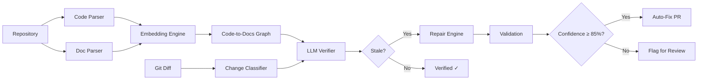

# DocsHealer 🩺📚

<div align="center">

**AI-Powered Self-Healing Technical Documentation**

[](https://www.python.org/downloads/)
[](https://www.typescriptlang.org/)
[](https://nextjs.org/)
[](https://opensource.org/licenses/MIT)
[](https://github.com/features/actions)

*Automatically keeps documentation synchronized with your codebase using AST parsing, semantic embeddings, and LLM-based verification.*

[Features](#-key-features) • [Installation](#-installation) • [Usage](#-usage) • [Architecture](#-architecture) • [Dashboard](#-dashboard) • [Contributing](#-contributing)

</div>

---

## 📖 Overview

DocsHealer is an intelligent documentation maintenance system that automatically detects when your code changes make documentation stale, and generates accurate fixes using GPT-4o. It integrates seamlessly into your GitHub workflow via GitHub Actions, analyzes pull requests, and creates auto-fix PRs when documentation needs updating.

### The Problem

- **Documentation Drift**: Code evolves faster than documentation can keep up
- **Manual Updates**: Developers forget to update docs when changing code
- **Review Overhead**: Reviewers struggle to catch documentation inconsistencies
- **False Negatives**: Simple text search can't detect semantic staleness

### The Solution


https://github.com/user-attachments/assets/b2b04be4-0048-4a23-979c-0d9007c3d434


DocsHealer uses a **9-stage AI pipeline** to:

1. **Parse Code & Docs** using AST analysis (Python, TypeScript, JavaScript)
2. **Build Semantic Index** using OpenAI embeddings to link code chunks to documentation sections
3. **Detect Changes** via Git diff analysis on pull requests
4. **Verify Staleness** using GPT-4o with structured output
5. **Generate Corrections** with LLM-based repair and validation
6. **Auto-Fix PRs** for high-confidence changes
7. **Flag for Review** for complex changes requiring human judgment

---

## ✨ Key Features

### 🤖 **Intelligent Detection**
- **AST-Based Parsing**: Extracts functions, classes, API endpoints, CLI commands, config schemas
- **Semantic Linking**: Uses text-embedding-3-small to match code chunks to documentation sections
- **Git Diff Analysis**: Identifies meaningful changes (ignores whitespace, comments, imports)

### 🔧 **Automated Fixes**
- **GPT-4o Verification**: Structured JSON output with confidence scores
- **Two-Pass Validation**: Accuracy, style, and completeness checks
- **Auto-Fix PRs**: Creates pull requests for high-confidence corrections (≥85%)
- **Manual Review Flags**: Posts PR comments for low-confidence or complex changes

### 📊 **Live Dashboard**
- **Real-Time Monitoring**: Track scans, affected docs, and AI corrections
- **GitHub Integration**: OAuth login, repository sync, PR management
- **Analytics**: Accuracy metrics, LLM costs, token usage, processing time
- **Live Pipeline**: Visual 9-stage workflow with WebSocket updates

### ⚙️ **Configurable**
- **Similarity Threshold**: Adjust semantic linking sensitivity (default: 0.75)
- **Auto-Fix Threshold**: Control confidence level for auto-fixes (default: 0.85)
- **File Patterns**: Include/exclude file types (*.py, *.ts, *.tsx, *.js, *.jsx)
- **LLM Model**: Choose OpenAI model (default: gpt-4o)

---

## 🚀 Installation

### Prerequisites

- **Python 3.11+**
- **Node.js 18+**
- **OpenAI API Key** ([Get one here](https://platform.openai.com/api-keys))
- **GitHub Personal Access Token** with `repo` and `pull_requests:write` scopes

### 1. Clone the Repository

```bash
git clone https://github.com/amartya1523/DocsHealer.git
cd DocsHealer
```

### 2. Install Python Dependencies

```bash
pip install -r requirements.txt
```

### 3. Install Node.js Dependencies

```bash
npm install
```

### 4. Configure Environment Variables

Create a `.env` file in the project root:

```bash
# Required
OPENAI_API_KEY=sk-your-openai-api-key
GITHUB_TOKEN=ghp_your-github-token

# Optional
DOCS_PATH=docs
SIMILARITY_THRESHOLD=0.75
AUTO_FIX_CONFIDENCE_THRESHOLD=0.85
LLM_MODEL=gpt-4o
FILE_PATTERNS=*.py,*.ts,*.tsx,*.js,*.jsx
```

### 5. Dashboard Setup (Optional)

```bash
cd dashboard
npm install

# Create .env.local
cat > .env.local << EOL
GITHUB_CLIENT_ID=your_oauth_client_id
GITHUB_CLIENT_SECRET=your_oauth_client_secret
NEXTAUTH_URL=http://localhost:3000
NEXTAUTH_SECRET=$(openssl rand -base64 32)
NEXT_PUBLIC_API_URL=http://localhost:8000
EOL

npm run dev
```

Dashboard will be available at http://localhost:3000

---

## 📘 Usage

### GitHub Action Integration (Recommended)

Add `.github/workflows/docs-healer.yml` to your repository:

```yaml
name: Docs Healer

on:
  pull_request:
    types: [opened, synchronize, reopened]

jobs:
  check-docs:
    runs-on: ubuntu-latest
    permissions:
      contents: write
      pull-requests: write
    
    steps:
      - uses: actions/checkout@v3
        with:
          fetch-depth: 0
          token: ${{ secrets.GITHUB_TOKEN }}
      
      - name: Run Docs Healer
        uses: amartya1523/DocsHealer@main
        with:
          openai_api_key: ${{ secrets.OPENAI_API_KEY }}
          github_token: ${{ secrets.GITHUB_TOKEN }}
          docs_path: 'docs'
          similarity_threshold: '0.75'
          auto_fix_confidence_threshold: '0.85'
```

**Add Repository Secrets:**

Go to `Settings` → `Secrets and variables` → `Actions` → `New repository secret`:
- `OPENAI_API_KEY`: Your OpenAI API key

The `GITHUB_TOKEN` is automatically provided by GitHub Actions.

### Local Execution

```bash
# Set environment variables
export OPENAI_API_KEY="sk-..."
export GITHUB_TOKEN="ghp_..."
export BASE_REF="main"
export HEAD_REF="feature-branch"
export PR_NUMBER="123"
export GITHUB_REPOSITORY="owner/repo"

# Run the pipeline
python docs_healer/main.py
```

### Manual Scan (Dashboard)

1. Start the dashboard: `cd dashboard && npm run dev`
2. Navigate to http://localhost:3000
3. Click **"Connect GitHub"**
4. Select a repository
5. Click **"Run Scan"**

---

## 🏗️ Architecture

### System Components

```
DocsHealer/
├── docs_healer/          # Python backend (core engine)
│   ├── main.py           # Orchestration & workflow
│   ├── code_parser.py    # AST parsing (Python, TS/JS)
│   ├── doc_parser.py     # Markdown parser
│   ├── embedding.py      # OpenAI embeddings
│   ├── index.py          # Semantic index builder
│   ├── diff_parser.py    # Git diff analysis
│   ├── verifier.py       # LLM staleness detection
│   ├── repair.py         # LLM correction generation
│   ├── github_manager.py # PR creation & comments
│   ├── config.py         # Configuration management
│   └── logger.py         # Structured logging
│
├── dashboard/            # Next.js dashboard (frontend)
│   ├── src/app/          # Next.js 16 App Router
│   ├── src/components/   # React components
│   ├── src/server/       # API routes & GitHub OAuth
│   └── src/data/         # Local state management
│
├── tests/                # Test suite
├── action.yml            # GitHub Action definition
├── ts_parser.js          # TypeScript/JavaScript AST parser
└── requirements.txt      # Python dependencies
```

### Processing Pipeline



### Data Flow

1. **Index Building** (Runs once per codebase modification):
   - Discovers code files (*.py, *.ts, *.tsx, *.js, *.jsx)
   - Parses AST and extracts code chunks (functions, classes, endpoints, etc.)
   - Parses markdown documentation into semantic sections
   - Generates embeddings using `text-embedding-3-small`
   - Builds semantic links via cosine similarity (threshold: 0.75)
   - Caches index in `.self-healing-docs/index.json`

2. **PR Verification** (Runs on every pull request):
   - Fetches Git diff between base and head commits
   - Identifies meaningful code changes (ignores comments, whitespace)
   - Maps changes to affected code chunks
   - Queries index for linked documentation sections
   - Verifies each section using GPT-4o with structured JSON output
   - Generates corrections for stale sections
   - Validates corrections (accuracy, style, completeness scores)
   - Creates auto-fix PR or flags for manual review

### Semantic Index Structure

```typescript
{
  "version": "1.0.0",
  "last_updated": "2026-07-06T19:03:01Z",
  "files_signature": {
    "docs_healer/main.py": 1704556800.0,
    // ... file modification timestamps
  },
  "code_chunks": {
    "docs_healer/main.py::main": {
      "id": "docs_healer/main.py::main",
      "type": "function",
      "name": "main",
      "qualified_name": "main",
      "file_path": "docs_healer/main.py",
      "line_start": 23,
      "line_end": 198,
      "signature": "def main()",
      "docstring": "...",
      "source_code": "...",
      "metadata": {}
    }
  },
  "doc_sections": {
    "docs/setup/installation.md::Setup > Installation": {
      "id": "docs/setup/installation.md::Setup > Installation",
      "file_path": "docs/setup/installation.md",
      "heading_path": "Setup > Installation",
      "heading_level": 2,
      "content": "...",
      "code_references": ["docs_healer/config.py::Config"],
      "line_start": 12,
      "line_end": 45,
      "metadata": {}
    }
  },
  "links": [
    {
      "code_chunk_id": "docs_healer/config.py::Config",
      "doc_section_id": "docs/setup/installation.md::Setup > Installation",
      "link_type": "explicit_mention",
      "confidence": 0.95,
      "metadata": {}
    }
  ]
}
```

---

## 🎨 Dashboard

The DocsHealer dashboard provides real-time monitoring and management of your documentation health.

### Features

- **📊 Dashboard Cards**: Repositories connected, doc sections indexed, code chunks parsed, AI fixes generated
- **🔄 Live Pipeline**: Visual 9-stage workflow with real-time progress
- **📝 Affected Documentation**: List of stale sections detected in scans
- **🤖 AI Corrections**: Auto-fix history with confidence scores and validation metrics
- **📈 Analytics**: Accuracy trends, LLM costs, token usage, processing times
- **🔗 Pull Requests**: Auto-generated PRs with fix details
- **📜 Logs**: Real-time console output from scans
- **⚙️ Settings**: Configure thresholds, LLM model, notifications

### Tech Stack

- **Framework**: Next.js 16 (App Router)
- **UI**: Radix UI + Tailwind CSS + Framer Motion
- **Data Fetching**: React Query (TanStack Query)
- **State Management**: Local JSON store (planned: PostgreSQL)
- **Auth**: NextAuth.js (GitHub OAuth)
- **Charts**: Recharts

### Screenshots

*(Coming soon)*

---

## 🧪 Testing

```bash
# Run Python tests
pytest tests/ -v

# Run with coverage
pytest tests/ --cov=docs_healer --cov-report=html

# Run specific test
pytest tests/test_parsers.py::test_python_function_parsing -v
```

---

## 📊 Performance

- **Index Building**: ~10-20s for typical repository (500 code files, 100 doc files)
- **PR Verification**: ~12-15s per pull request (6 doc sections, 10 code changes)
- **Cache Hit Ratio**: ~60-90% (embeddings are cached)
- **LLM Cost**: ~$0.20-$0.40 per PR scan (depends on changes)

### Optimization Tips

1. **Use Index Cache**: Avoid rebuilding index on every run
2. **Adjust Thresholds**: Lower `similarity_threshold` to reduce false positives
3. **Parallel Workers**: Set `parallel_workers` in config for concurrent LLM calls
4. **Model Selection**: Use `gpt-4o-mini` for faster/cheaper verifications

---

## 🛠️ Configuration

### Environment Variables

| Variable | Description | Default | Required |
|----------|-------------|---------|----------|
| `OPENAI_API_KEY` | OpenAI API key | - | ✅ |
| `GITHUB_TOKEN` | GitHub personal access token | - | ✅ |
| `DOCS_PATH` | Path to documentation directory | `docs` | ❌ |
| `SIMILARITY_THRESHOLD` | Cosine similarity threshold (0.0-1.0) | `0.75` | ❌ |
| `AUTO_FIX_CONFIDENCE_THRESHOLD` | LLM confidence for auto-fix (0.0-1.0) | `0.85` | ❌ |
| `LLM_MODEL` | OpenAI model for verification | `gpt-4o` | ❌ |
| `FILE_PATTERNS` | Comma-separated file patterns | `*.py,*.ts,*.tsx,*.js,*.jsx` | ❌ |

### GitHub Action Inputs

```yaml
inputs:
  openai_api_key:
    description: "OpenAI API Key"
    required: true
  github_token:
    description: "GitHub Token for opening PRs and adding comments"
    required: true
  docs_path:
    description: "Path to documentation directory"
    required: false
    default: "docs"
  similarity_threshold:
    description: "Cosine similarity threshold for semantic linking (0.0 to 1.0)"
    required: false
    default: "0.75"
  auto_fix_confidence_threshold:
    description: "LLM confidence threshold for automatically creating doc fix PRs (0.0 to 1.0)"
    required: false
    default: "0.85"
  llm_model:
    description: "OpenAI model to use for verification and repairs"
    required: false
    default: "gpt-4o"
  file_patterns:
    description: "Comma-separated glob patterns to include or exclude (e.g. *.py, *.ts)"
    required: false
    default: "*.py,*.ts,*.tsx,*.js,*.jsx"
```

---

## 🤝 Contributing

Contributions are welcome! Please follow these guidelines:

### Development Setup

```bash
# Clone the repository
git clone https://github.com/amartya1523/DocsHealer.git
cd DocsHealer

# Create virtual environment
python -m venv venv
source venv/bin/activate  # On Windows: venv\Scripts\activate

# Install dependencies
pip install -r requirements.txt
pip install -e .  # Install in editable mode

# Run tests
pytest tests/ -v
```

### Contribution Workflow

1. **Fork** the repository
2. **Create a feature branch**: `git checkout -b feature/amazing-feature`
3. **Make changes** and add tests
4. **Run tests**: `pytest tests/ -v`
5. **Commit**: `git commit -m "feat: add amazing feature"`
6. **Push**: `git push origin feature/amazing-feature`
7. **Open a Pull Request**

### Commit Convention

Follow [Conventional Commits](https://www.conventionalcommits.org/):

- `feat:` New feature
- `fix:` Bug fix
- `docs:` Documentation changes
- `test:` Test changes
- `refactor:` Code refactoring
- `chore:` Maintenance tasks

---

## 📄 License

This project is licensed under the MIT License - see the [LICENSE](LICENSE) file for details.

---

## 🙏 Acknowledgments

- **OpenAI** for GPT-4o and text-embedding-3-small models
- **GitHub** for Actions and API
- **Next.js** team for the amazing framework
- **Radix UI** for accessible components
- **All contributors** who help improve DocsHealer

---

## 📮 Contact

- **Author**: Amartya Vikram Singh
- **GitHub**: [@amartya1523](https://github.com/amartya1523)
- **Email**: amartyasingh556@gmail.com

---

## 🗺️ Roadmap

- [ ] Support for more languages (Go, Rust, Java, C++)
- [ ] Support for API documentation formats (OpenAPI, GraphQL)
- [ ] Slack/Discord notifications
- [ ] Self-hosted LLM support (Llama 3, Mistral)
- [ ] VS Code extension
- [ ] Automated changelog generation
- [ ] Documentation quality scoring
- [ ] Multi-repository dashboard

---

<div align="center">

**Made with ❤️ by [Amartya Vikram Singh](https://github.com/amartya1523)**

⭐ Star this repository if you find it helpful!

</div>
